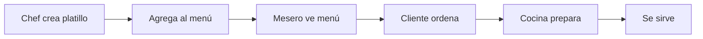

# 📖 Módulo de Menú del Restaurante

## 🎯 Propósito

El módulo de **Menú** permite gestionar los platillos, bebidas y productos que se ofrecen a los clientes. Es diferente del **Inventario** (que maneja ingredientes y stock).

## 🔑 Conceptos Clave

### **Inventario** vs **Menú**

| Inventario | Menú |
|------------|------|
| Ingredientes y productos base | Platillos terminados |
| Ej: Pollo por kg, Tomates | Ej: Hamburguesa Especial, Ensalada César |
| Precio de compra y venta | Solo precio al público |
| Control de stock | Disponibilidad (sí/no) |
| Unidades de medida | No aplica |

### Ejemplo Práctico:
- **Inventario**: Carne molida (1kg), Pan, Lechuga, Tomate
- **Menú**: Hamburguesa Especial ($8.50)

## 📋 Características

### Categorías del Menú
- Entradas
- Platos Fuertes
- Postres
- Bebidas
- Cócteles
- Promociones
- Etc.

**Propiedades:**
- Nombre
- Descripción
- Orden de visualización
- Estado (activa/inactiva)

### Platillos (Menu Items)
- Nombre del platillo
- Descripción apetitosa
- Categoría
- Precio de venta
- Tiempo de preparación
- Imagen (URL)
- Disponibilidad (disponible/agotado)
- Destacado (⭐)

## 🎨 Interfaz de Usuario

### Vista Principal
- **Tarjetas visuales** con imagen del platillo
- **Filtros** por categoría y disponibilidad
- **Búsqueda** por nombre
- **Badge "Destacado"** para platillos especiales
- **Toggle** rápido de disponibilidad

### Acciones Rápidas
- ✅ Habilitar/Deshabilitar platillo
- ✏️ Editar información
- 🗑️ Eliminar del menú
- ⭐ Marcar como destacado

## 🔧 Casos de Uso

### 1. Crear Nuevo Platillo
```
1. Click en "+ Nuevo Platillo"
2. Llenar formulario:
   - Nombre: "Pasta Carbonara"
   - Descripción: "Pasta fresca con salsa carbonara, tocino y queso parmesano"
   - Categoría: "Platos Fuertes"
   - Precio: $12.50
   - Tiempo: 15 minutos
   - Imagen: URL de la foto
   - ✓ Disponible
   - ⭐ Destacado
3. Guardar
```

### 2. Organizar por Categorías
```
1. Crear categorías con orden:
   - Entradas (orden: 1)
   - Platos Fuertes (orden: 2)
   - Postres (orden: 3)
   - Bebidas (orden: 4)
2. Asignar platillos a cada categoría
```

### 3. Agotar un Platillo
```
Cuando se acaban ingredientes:
1. Click en "Deshabilitar"
2. El platillo muestra "✗ No disponible"
3. Los meseros lo ven pero no pueden ordenarlo
```

### 4. Promociones Especiales
```
1. Marcar platillos como "⭐ Destacados"
2. Aparecen con badge dorado
3. Se pueden mostrar en sección especial
```

## 📊 Flujo de Trabajo



## 🔐 Permisos

| Rol | Ver Menú | Crear/Editar | Eliminar |
|-----|----------|--------------|----------|
| Admin | ✅ | ✅ | ✅ |
| Manager | ✅ | ✅ | ✅ |
| Waiter | ✅ | ❌ | ❌ |
| Cashier | ✅ | ❌ | ❌ |

## 🎯 Mejores Prácticas

### Nombres de Platillos
✅ **Bueno:**
- "Hamburguesa Especial de la Casa"
- "Ensalada César con Pollo Grillado"
- "Pasta Alfredo"

❌ **Malo:**
- "Platillo 1"
- "Comida"
- "PROD-001"

### Descripciones
✅ **Bueno:**
"Jugosa hamburguesa de carne Angus, queso cheddar, tocino crujiente, lechuga fresca, tomate y cebolla caramelizada en pan artesanal"

❌ **Malo:**
"Hamburguesa con ingredientes"

### Imágenes
- Alta calidad
- Buena iluminación
- Plato bien presentado
- Fondo neutral
- Tamaño recomendado: 800x600px

### Precios
- Redondear a .00, .50 o .99
- Mantener márgenes de ganancia
- Considerar competencia
- Actualizar regularmente

### Categorización
- Máximo 8-10 categorías
- Nombres claros e intuitivos
- Orden lógico (Entradas → Platos → Postres → Bebidas)
- Agrupar platillos similares

## 💡 Tips

1. **Platillos Destacados**: Úsalos para platillos con mejor margen o que quieras promover

2. **Tiempo de Preparación**: Ayuda al mesero a informar al cliente tiempos de espera

3. **Actualización Regular**: Revisa disponibilidad al inicio de cada turno

4. **Menú Estacional**: Crea categorías temporales (ej: "Especiales de Verano")

5. **Fotos Profesionales**: Invierte en buenas fotos, aumentan ventas hasta 30%

## 📱 Integración con Órdenes

Próximamente se podrá:
- Seleccionar platillos del menú al crear órdenes
- Ver ingredientes necesarios del inventario
- Reducir stock automáticamente
- Sugerir platillos según disponibilidad

## 🚀 Roadmap

### Próximas Funciones
- [ ] Variantes de platillos (Tamaño: Chico/Mediano/Grande)
- [ ] Complementos y extras ($1.00 extra queso)
- [ ] Combos y paquetes
- [ ] Relación con inventario (ingredientes necesarios)
- [ ] Menú digital para clientes (QR Code)
- [ ] Análisis de platillos más vendidos
- [ ] Recetas y preparación paso a paso
- [ ] Alergenos y información nutricional

## 📚 Ejemplos Completos

### Restaurante Casual

**Categorías:**
1. Entradas (🥗)
2. Hamburguesas (🍔)
3. Pizzas (🍕)
4. Postres (🍰)
5. Bebidas (🥤)

**Platillos Ejemplo:**

```json
{
  "name": "Hamburguesa BBQ Bacon",
  "description": "Carne Angus 180g, queso cheddar, tocino ahumado, cebolla morada, salsa BBQ casera en pan brioche",
  "category": "Hamburguesas",
  "price": 11.99,
  "preparation_time": 12,
  "is_featured": true,
  "is_available": true,
  "image_url": "https://example.com/burger.jpg"
}
```

### Cafetería

**Categorías:**
1. Café ☕
2. Bebidas Frías 🧊
3. Repostería 🥐
4. Sándwiches 🥪

### Restaurante Fino

**Categorías:**
1. Aperitivos 🍤
2. Sopas y Ensaladas 🥗
3. Carnes 🥩
4. Pescados y Mariscos 🐟
5. Pasta 🍝
6. Postres Gourmet 🍮
7. Vinos 🍷

## 🎓 Formación del Personal

### Meseros
- Conocer todos los platillos
- Memorizar platillos destacados
- Saber ingredientes principales
- Poder recomendar según gusto del cliente

### Cocina
- Revisar menú actualizado diariamente
- Reportar platillos que no se pueden preparar
- Mantener tiempos de preparación

### Gerencia
- Actualizar precios mensualmente
- Analizar platillos más/menos vendidos
- Crear promociones estratégicas
- Mantener menú actualizado

---

**¡El módulo de Menú está listo para usar!** 🎉

Para soporte adicional, revisa la [documentación de la API](http://localhost:8000/docs) o el [README principal](README.md).

